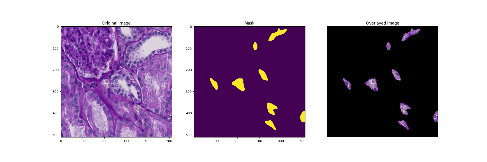
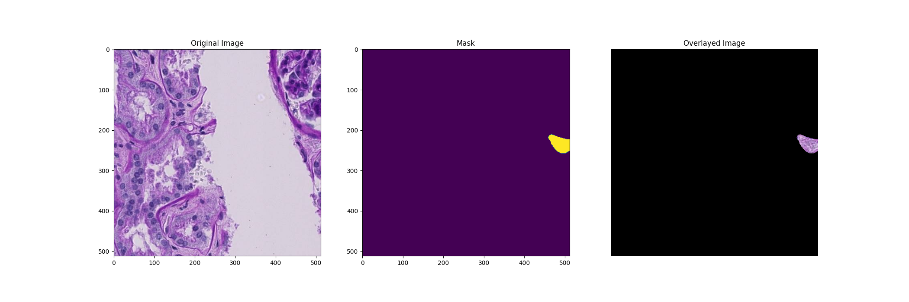
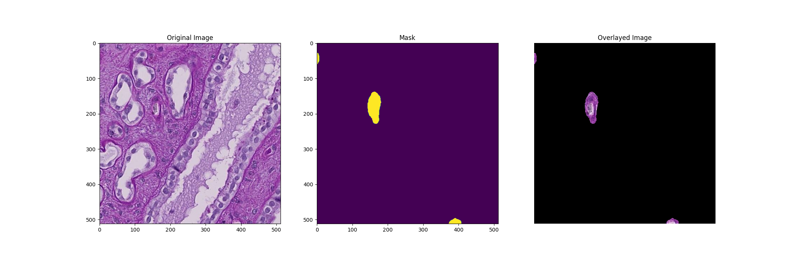

#  Segment instances of microvascular structures from healthy human kidney tissue slides.

**Why?**
The proper operation of your body's organs and tissues relies on the interaction, spatial arrangement, and specialization of your cells, and there are a staggering 37 trillion of them. With such a vast number of cells, comprehending their functions and relationships represents a monumental task.
Ongoing initiatives to chart these cells involve the Vasculature Common Coordinate Framework (VCCF), which utilizes the human body's blood vasculature as the primary navigation system. The VCCF spans across all levels, ranging from the entire body down to the individual cell level, providing a distinctive means to pinpoint cellular locations using capillary structures as an addressing system. However, gaps in our understanding of microvasculature create gaps in the VCCF itself. If we could automatically segment microvasculature patterns, researchers would be able to leverage real-world tissue data to begin bridging these gaps and constructing a comprehensive map of the vasculature

## Example





## Models:
UNET (base line)
Transfer learning (Hopefully in the near future!)
Transformer (Hopefully in the near future!)
...


## How to use?
**Download**
```git clone https://github.com/zamanzadeh98/Microvascular_Segmentation.git```

**Installing packages**
```!pip install requirements.txt```

Then, you can simply replace the model and image paths in the following scripts
```python your_script.py /path/to/your/model.pth /path/to/your/data.jpg```


## Results
Current baseline: 
1 - Jaccard Index : 45.41%

**What is jaccard Index?**
### Jaccard Index

The Jaccard Index, also known as the Jaccard similarity coefficient, is a measure of similarity between two sets. It is often used in data science and information retrieval to compare the similarity between two data sets, such as sets of words, documents, or elements.

The Jaccard Index is defined as the size of the intersection of the sets divided by the size of the union of the sets. It is expressed using the following formula:

 = \frac{|A \cap B|}{|A \cup B|})

Where:
- J(A, B) is the Jaccard Index between sets A and B.
- |A \cap B| represents the size of the intersection of sets A and B.
- |A \cup B| represents the size of the union of sets A and B.

The Jaccard Index ranges from 0 to 1, where 0 indicates no similarity between the sets, and 1 indicates that the sets are identical.


[Dataset](https://www.kaggle.com/competitions/hubmap-hacking-the-human-vasculature/data)

